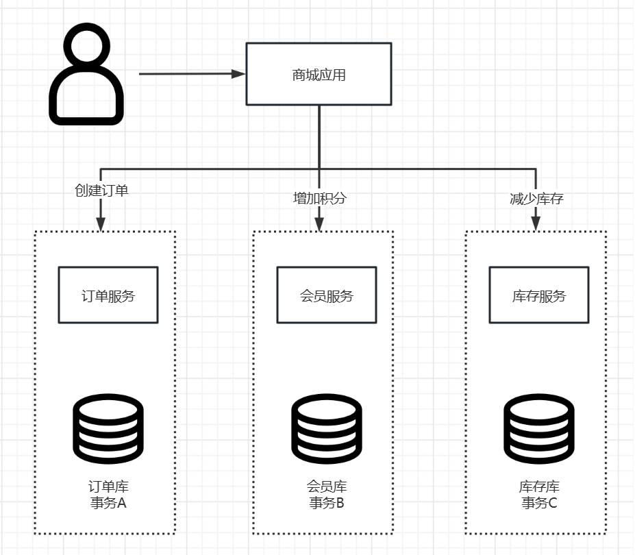
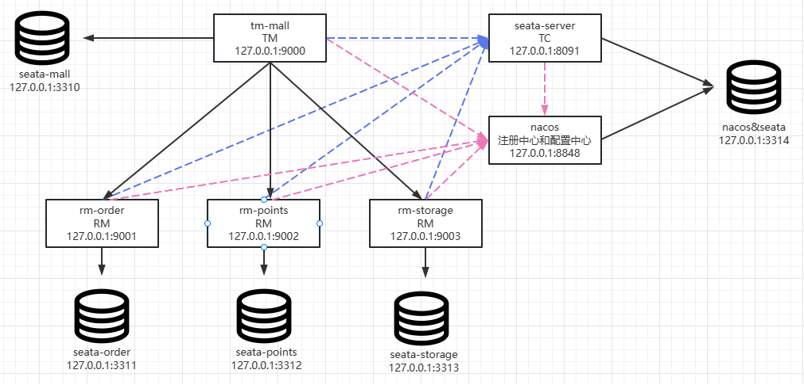

# Spring Cloud Alibaba
## 1. Nacos 服务治理
- nacos 注册中心
## 2. 微服务通信
- 负载均衡
- OpenFeign 简化服务间通信
- Dubbo 与 Nacos 体系协同
## 3. 系统保护
- sentinel 流控
- sentinel 降级
- nacos 配置中心
## 高级特性
- Sleuth+Zipkin 实施链路跟踪
- Seata 实现分布式事务
- RocketMQ 实现服务异步通信

## 综合实战 [seata-mall]

某线上商城会员在购买商品的同时产生相应的消费积分，案例示意图如下:

看整体架构图如下:

